## TUGAS PRAKTIKUM PEMROGRAMAN WEB

|       DEVI SILMA YUNIAR     |       312010458     |
|-----------------------------|---------------------|
|          PERTEMUAN 12       |      PRAKTIKUM 11   |

## Dipertemuan kali ini saya akan mempelajari PHP FRAMEWORK (CODEIGNITER) beserta cara menggunakannya.

## LANGKAH LANGKAH PRAKTIKUM

## PERSIAPAN
Sebelum memulai menggunakan Framework codeigniter, perlu dilakukan konfigurasi pada webserver. Beberapa ekstensi PHP perlu di aktifkan untuk kebutuhan pengembangan Codeigniter 4.

## Berikut beberapa ekstensi yang perlu diaktifkan:

- php-json ekstension untuk bekerja dengan JSON;
- php-mysqlnd native driver untuk MySQL
- php-xml ekstension untuk bekerja dengan XML;
- php-intl ekstensi untuk membuat aplikasi multibahasa;
- libcurl (opsional), jika ingin pakai Curl.

## 1. UNTUK MENGAKTIFKAN EKSTENSI TERSEBUT MELALUI XAMPP CONTROL PANEL PADA BAGIAN APACHE KLIK CONFIG -> PHP.ini
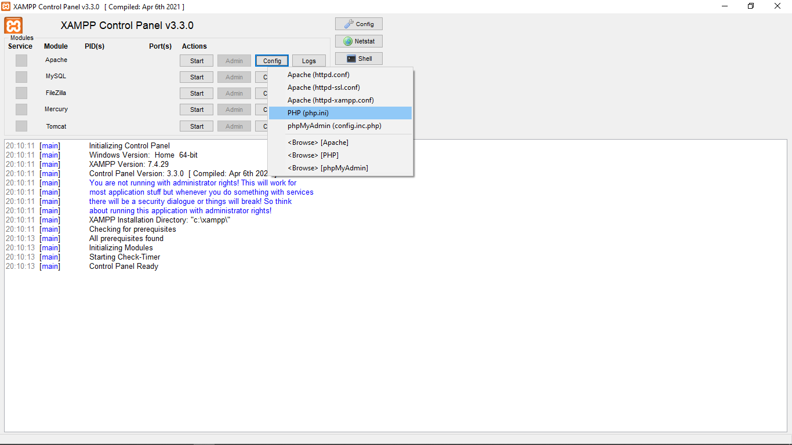
Pilih dan klik PHP.ini

## 2. PADA BAGIAN EKSTENSION,HILANGKAN TANDA ; (titik koma) pada ekstensi yang akan diaktifkan. Kemudian simpan kembali filenya dan restart Apache web server.
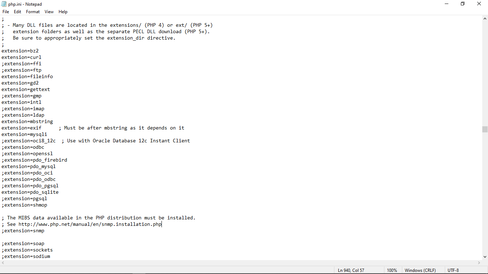
Akyifkan beberapa extansion deperti contoh diatas

## 3. KEMUDIAN BUAT FOLDER BARU DENGAN NAMA lab11_php_ci
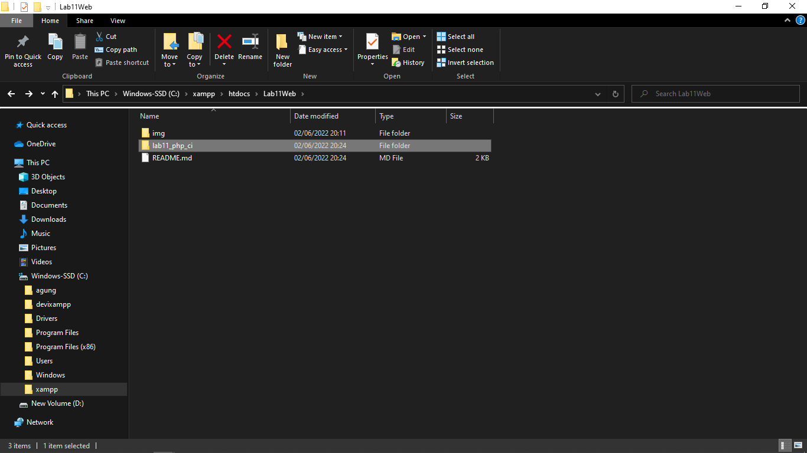

## 4. INSTALISASI CODEIGNITER.4
Untuk melakukan instalasi codeigniter 4 dapat dilakukan dengan dua cara , yaitu cara manual dan menggunakan composer. pada praktikum ini kita menggunakan cara manual.

- Unduh Codeigniter dari website https://codeigniter.com/download
- Extrak file zip Codeigniter ke directori htdocs/lab11_ci.
- Ubah nama direktory framework-4.x.xx menjadi ci4
- Buka browser dengan alamat http://localhost/Lab11Web/lab11_php_ci/ci4/public/
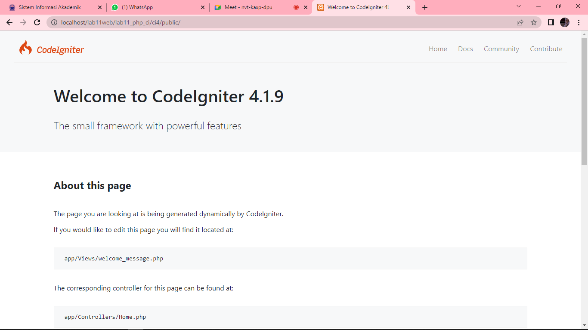

Codeigniter berhasil didownload dan disimpan file ekstrak nya

## 5). MENJALANKAN CLI (Command Line Interface)
Codeigniter 4 menyediakan CLI untuk mempermudah proses development. Untuk mengakses CLI buka terminal/command prompt.
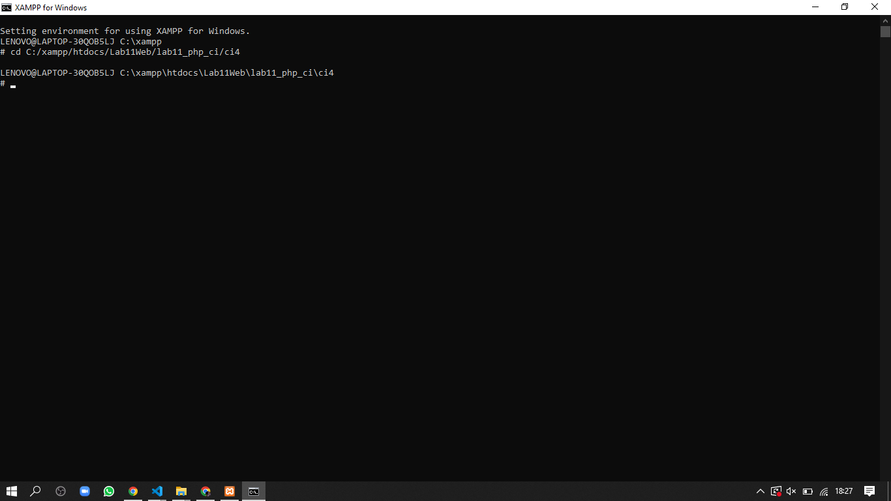

Arahkan lokasi direktori sesuai dengan direktori kerja project dibuat (C:\xampp\htdocs\Lab11Web\lab11_php_ci\ci4)

Perintah yang dapat dijalankan untuk memanggil CLI Codeigniter adalah
```php
php spark
```

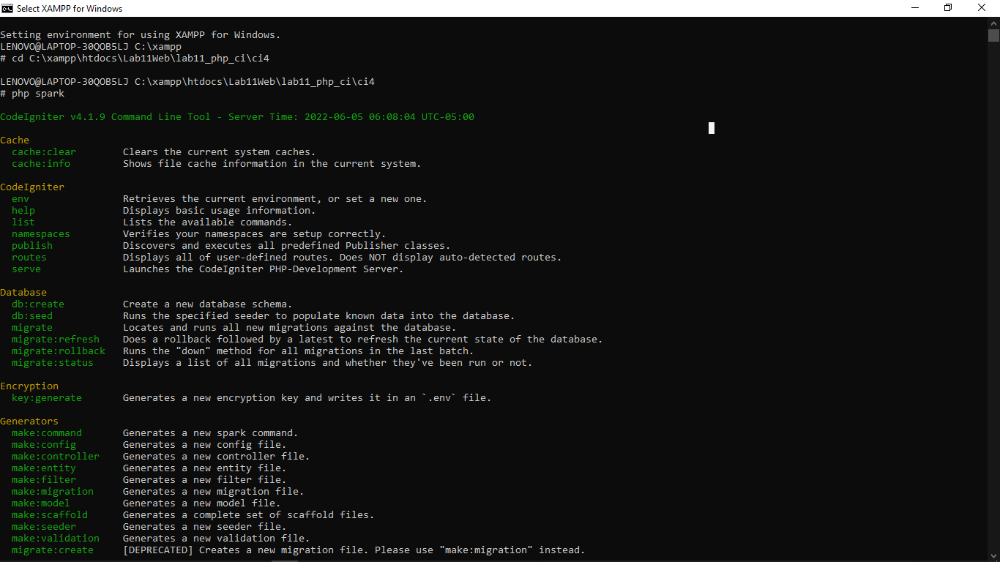
Php spark berhasil dipanggil

## 6). MENGAKTIFKAN MODE DEBUGGING
Codeigniter 4 menyediakan fitur debugging untuk memudahkan developer untuk mengetahui pesan erorr apabila terjadi kesalahan membuat kode program.

Secara default fitur ini belum aktif. Ketika terjadi erorr pada aplikasi akan ditampilkan pesan seperti berikut.
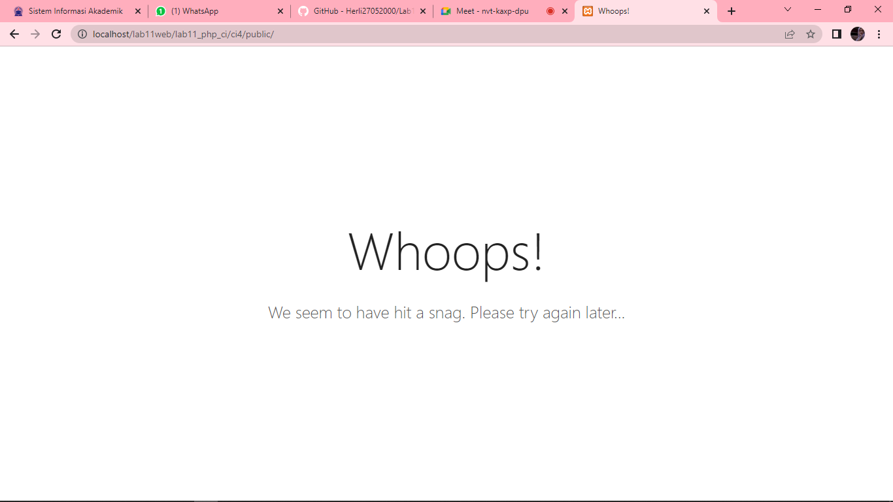

Semua jenis erorr akan ditampilkan sama. Untuk memudahkan mengetahui jenis erorrnya, maka perlu diaktifkan mode debugging dengan mengubah nilai konfigurasi pada environment variable CI_ENVIRONMENT menjadi development.
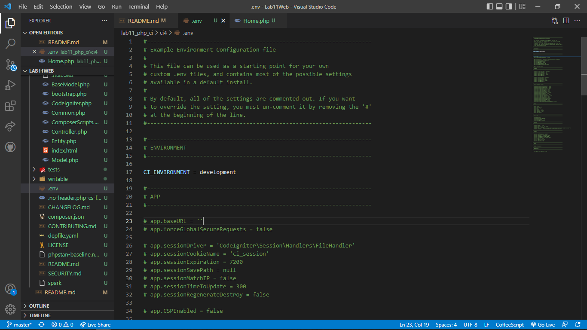

Ubah nama file env menjadi .env kemudian buka file tersebut dan ubah nilai variable CI_ENVIRONMENT menjadi development.
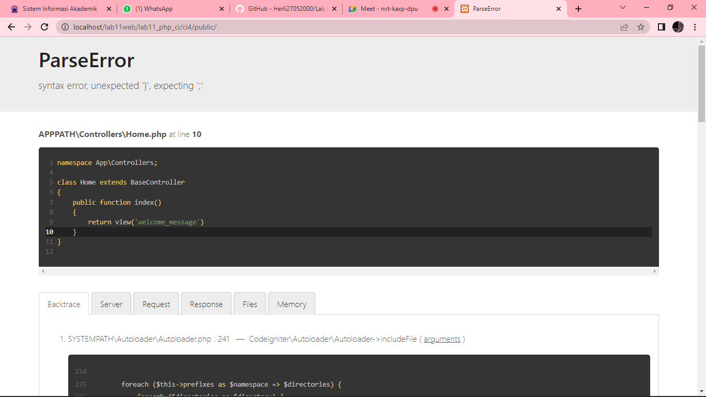

Contoh erorr yang terjadi. Untuk mencoba erorr tersebut, ubah kode pada file app/Controller/Home.php hilangkan titik koma pada akhir kode.
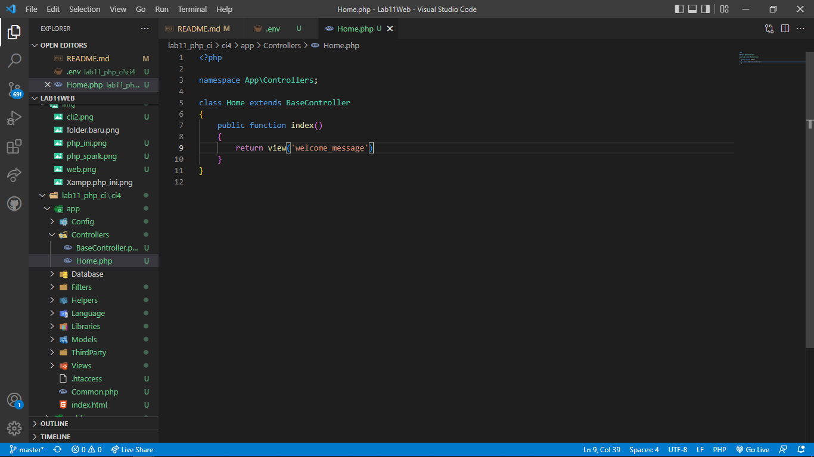
dan akan erorr seperti gambar tampilan browser digambar sebelumnya.

## 7). MEMBUAT ROUTE BARU
Tambahkan kode berikut di dalam Routes.php

```php
$routes->get('/about', 'Page::about');
$routes->get('/contact', 'Page::contact');
$routes->get('/faqs', 'Page::faqs');

```
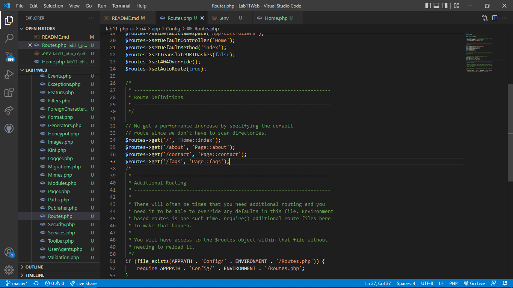
untuk mengetahui routes yang ditambahkan sudah benar, buka CLI dan jalankan perintah berikut.
```php
PHP Spark routes
```


Selanjutnya coba akses route yang telah dibuat dengan mengakses alamat url: http://localhost:8080/about

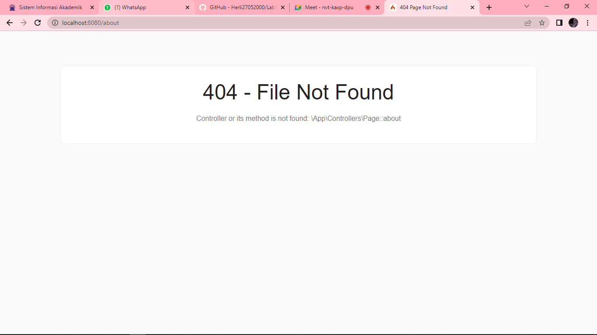

Ketika diakses akan muncul tampilan erorr 404 file not found, itu artinya file/page tersebut tidak ada. Untuk mengakses halaman tersebut, harus dibuat terlebih dahulu Controller yang sesuai dengan routing yang dibuat yaitu Controller Page.

## 8). MEMBUAT CONTROLLER

Selanjutnya adalah membuat Controller Page. Buat file dengan nama page.php pada direktori Controller kemudian isi kodenya seperti berikut.

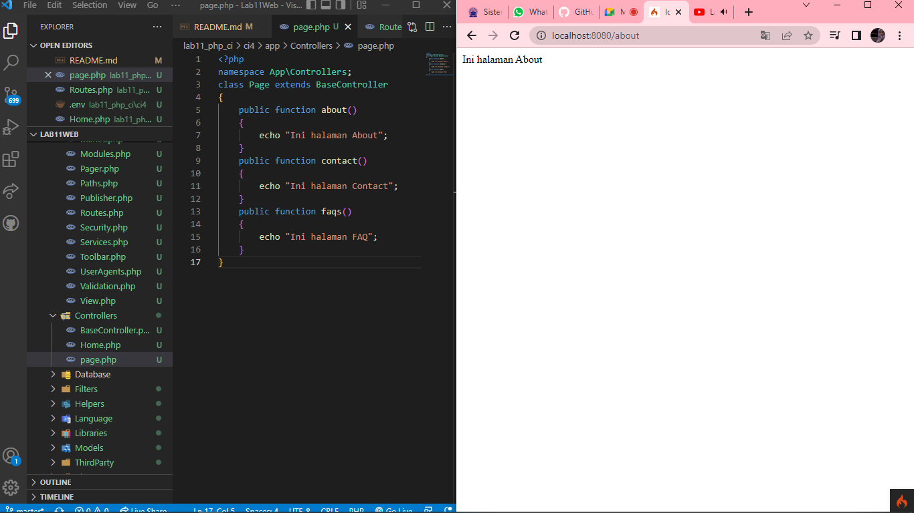

Refresh kembali browser,maka akan ditampilkan hasilnya seperti diatas,dan halaman sudah dapat di akses.

## 9). AUTO ROUTING

Secara default fitur autoroute pada Codeigniter sudah aktif. Untuk mengubah status autoroute dapat mengubah nilai variablenya. Untuk menonaktifkan ubah nilai true menjadi false.

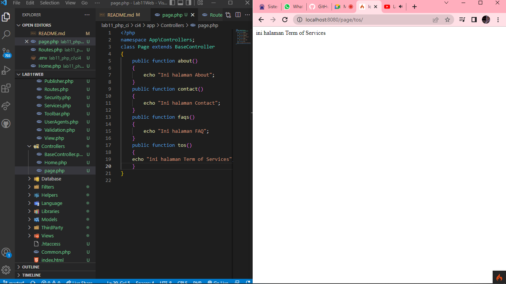

Method ini belum ada pada routing, sehingga cara mengaksesnya dengan menggunakan alamat url: http://localhost:8080/page/tos/

## 10). MEMBUAT VIEWS

Selanjutnya adalah membuat view untuk tampilan web agar lebih menarik. Buat file baru dengan nama about.php pada direktori view (app/view/about.php) kemudian isi kodenya seperti berikut.

```php
<!DOCTYPE html>
<html lang="en">
<head>
    <meta charset="UTF-8">
    <title><?= $title; ?></title>
</head>
<body>
    <h1><?= $title; ?></h1>
    <hr>
    <p><?= $content; ?></p>
</body>
</html>
```

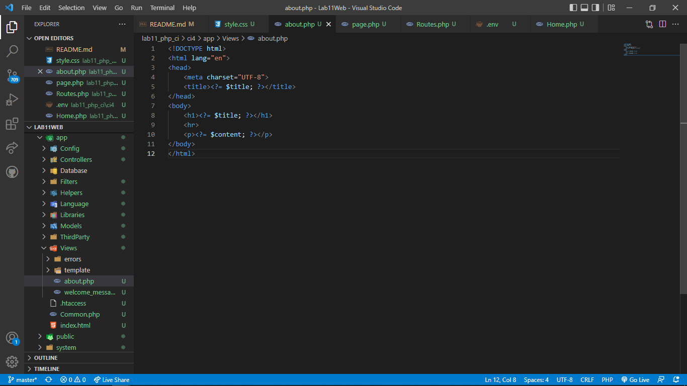

Ubah method about pada class controller page menjadi seperti berikut :

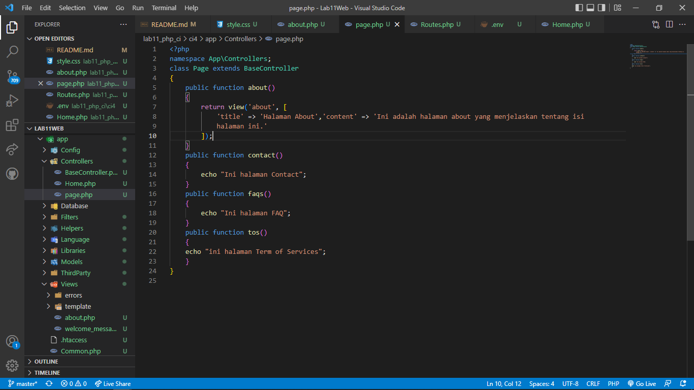
 Maka hasilnya akan seperti ini di browser

 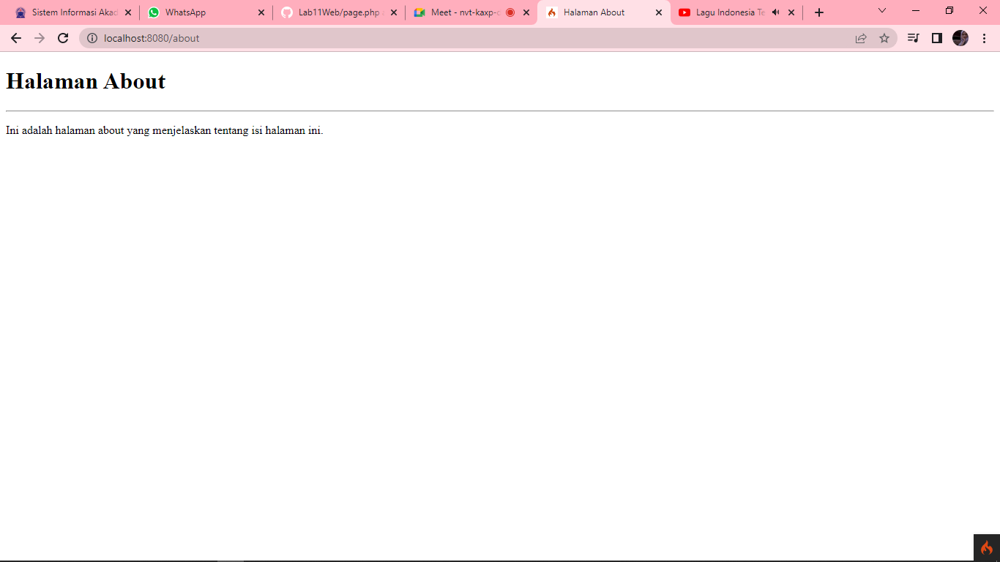

 ## 11.) MEMBUAT LAYOUT WEB DENGAN CSS
 
 Pada dasarnya layout web dengan css dapat diimplementasikan dengan mudah pada codeigniter. Yang perlu diketahui adalah, pada Codeigniter 4 file yang menyimpan asset css dan javascript terletak pada direktori public.

Buat file css pada direktori public dengan nama style.css (copy file dari praktikum lab4_layout) Kita akan gunakan layout yang pernah dibuat pada praktikum 4.

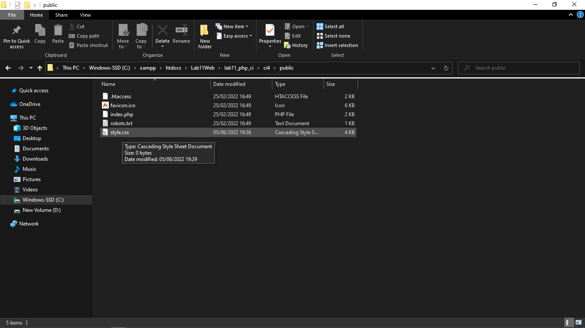
Kemudian buat folder template pada direktori view kemudian buat file header.php dan footer.php

seperti dibawah :

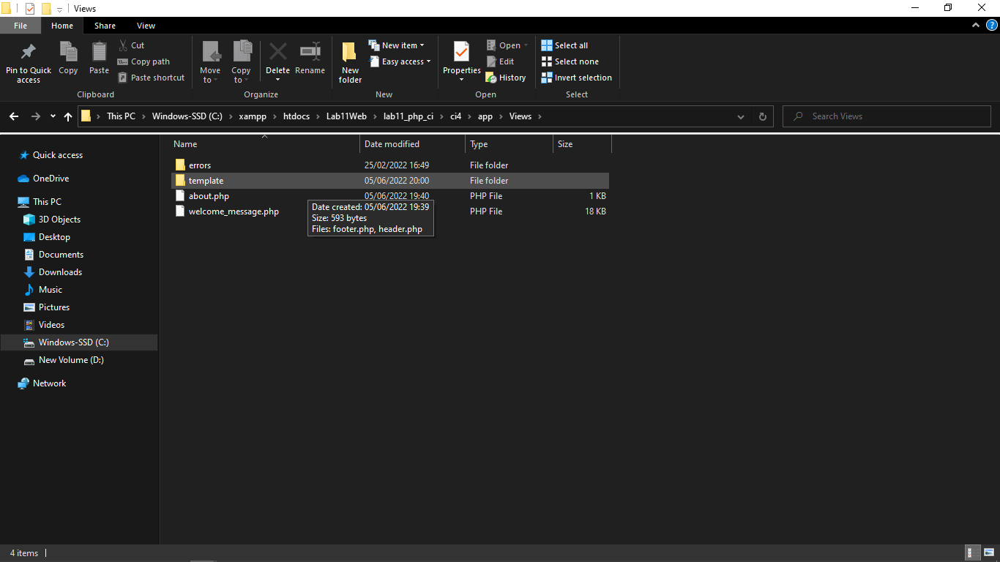

Dan tambahkan file di dalamnya

header.php
```php
<!DOCTYPE html>
<html lang="en">
<head>
    <meta charset="UTF-8">
    <title><?= $title; ?></title>
    <link rel="stylesheet" href="<?= base_url('/style.css');?>">
</head>
<body>
    <div id="container">
    <header>
        <h1>Layout Sederhana</h1>
    </header>
    <nav>
        <a href="<?= base_url('/');?>" class="active">Home</a>
        <a href="<?= base_url('/artikel');?>">Artikel</a>
        <a href="<?= base_url('/about');?>">About</a>
        <a href="<?= base_url('/contact');?>">Kontak</a>
    </nav>
    <section id="wrapper">
        <section id="main">
```

footer.php
```php
</section>
            <aside id="sidebar">
                <div class="widget-box">
                    <h3 class="title">Widget Header</h3>
                    <ul>
                        <li><a href="#">Widget Link</a></li>
                        <li><a href="#">Widget Link</a></li>
                    </ul>
                </div>
                <div class="widget-box">
                    <h3 class="title">Widget Text</h3>
                    <p>Vestibulum lorem elit, iaculis in nisl volutpat, malesuada
                    tincidunt arcu. Proin in leo fringilla, vestibulum mi porta, faucibus felis.
                    Integer pharetra est nunc, nec pretium nunc pretium ac.</p>
                </div>
            </aside>
        </section>
    <footer>
        <p>&copy; 2022 - Universitas Pelita Bangsa</p>
    </footer>
    </div>
</body>
</html>
```

Kemudian ubah file app/view/about.php seperti berikut : 

about.php

```php
<?= $this->include('template/header'); ?>

<h1><?= $title; ?></h1>
<hr>
<p><?= $content; ?></p>

<?= $this->include('template/footer'); ?>
```

Kemudian refresh dan lihat kembali hasilnya pada browser. 

Maka tampilannya akan seperti berikut :

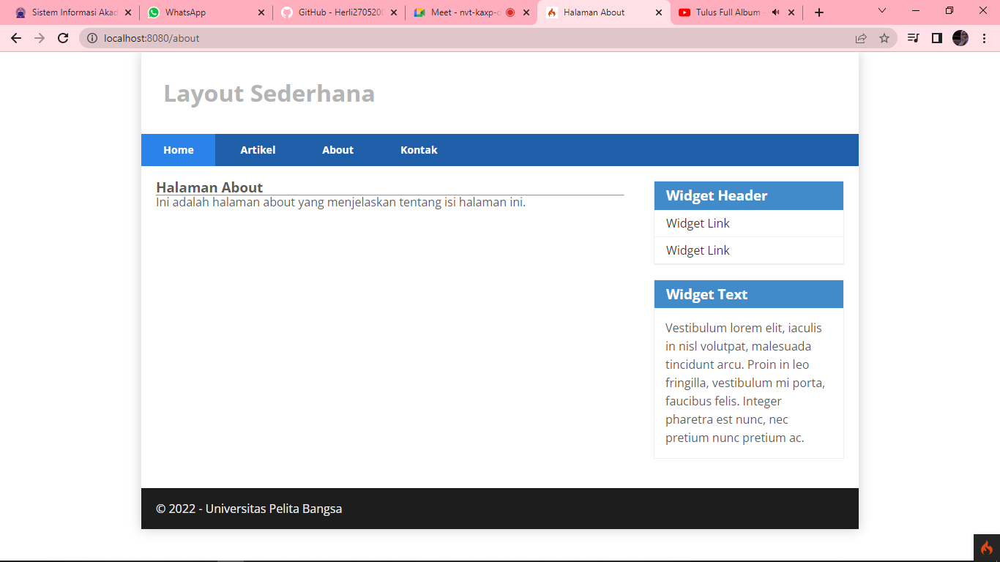


## PERTANYAAN DAN TUGAS 

Lengkapi kode program untuk menu lainnya yang ada pada Controller Page, sehingga semua link pada navigasi header dapat menampilkan tampilan dengan layout yang sama.

Hasil

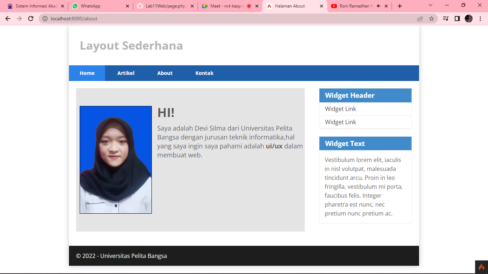

Diatas adalah halaman about

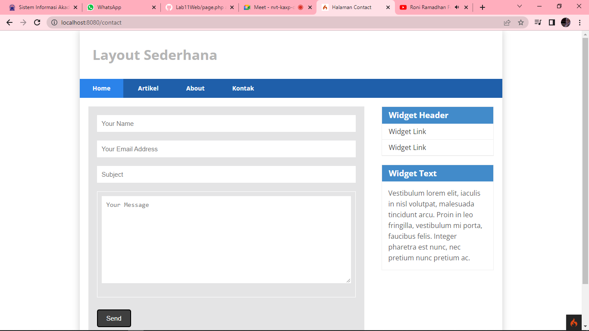

Buat file baru pada views dengan nama file contact.php dan juga ubah pada Controller dibagian file page.php dengan menambahkan include footer/header.

## PERTEMUAN KALI INI CUKUP SAMPAI DISINI
## TERIMAKASIH
-------------------------------------------------------------------------------------------------------------------
                                                @devisilma26


