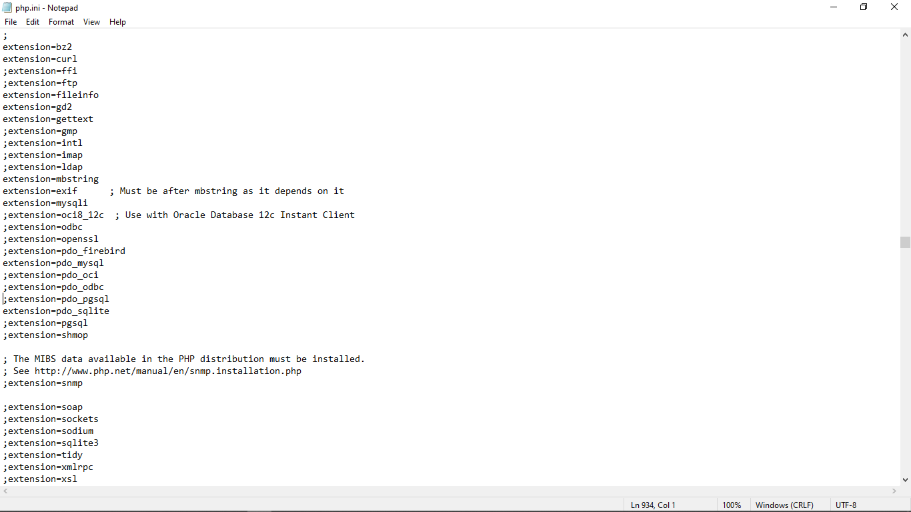

## TUGAS PRAKTIKUM PEMROGRAMAN WEB

|       DEVI SILMA YUNIAR     |       312010458     |
|-----------------------------|---------------------|
|          PERTEMUAN 12       |      PRAKTIKUM 11   |

## Dipertemuan kali ini saya akan mempelajari PHP FRAMEWORK (CODEIGNITER) beserta cara menggunakannya.

## LANGKAH LANGKAH PRAKTIKUM

## PERSIAPAN
Sebelum memulai menggunakan Framework codeigniter, perlu dilakukan konfigurasi pada webserver. Beberapa ekstensi PHP perlu di aktifkan untuk kebutuhan pengembangan Codeigniter 4.

## Berikut beberapa ekstensi yang perlu diaktifkan:

- php-json ekstension untuk bekerja dengan JSON;
- php-mysqlnd native driver untuk MySQL
- php-xml ekstension untuk bekerja dengan XML;
- php-intl ekstensi untuk membuat aplikasi multibahasa;
- libcurl (opsional), jika ingin pakai Curl.

## 1. UNTUK MENGAKTIFKAN EKSTENSI TERSEBUT MELALUI XAMPP CONTROL PANEL PADA BAGIAN APACHE KLIK CONFIG -> PHP.ini

Pilih dan klik PHP.ini

## 2. PADA BAGIAN EKSTENSION,HILANGKAN TANDA ; (titik koma) pada ekstensi yang akan diaktifkan. Kemudian simpan kembali filenya dan restart Apache web server.

Akyifkan beberapa extansion deperti contoh diatas

## 3. KEMUDIAN BUAT FOLDER BARU DENGAN NAMA lab11_php_ci

## 4. INSTALISASI CODEIGNITER.4
Untuk melakukan instalasi codeigniter 4 dapat dilakukan dengan dua cara , yaitu cara manual dan menggunakan composer. pada praktikum ini kita menggunakan cara manual.

- Unduh Codeigniter dari website https://codeigniter.com/download
- Extrak file zip Codeigniter ke directori htdocs/lab11_ci.
- Ubah nama direktory framework-4.x.xx menjadi ci4
- Buka browser dengan alamat http://localhost/Lab11Web/lab11_php_ci/ci4/public/

